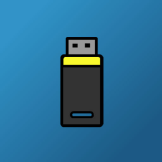

# Byte-Converter-Mobile-App
A mobile app for android devices that allows people to convert a specified amount of digital storage to a different byte unit. 

# How to get the app
There is only one version of the length converter app: a free version. It is available on the google play store.
  - free version https://play.google.com/store/apps/details?id=com.brandon.digitalstorageconverter
